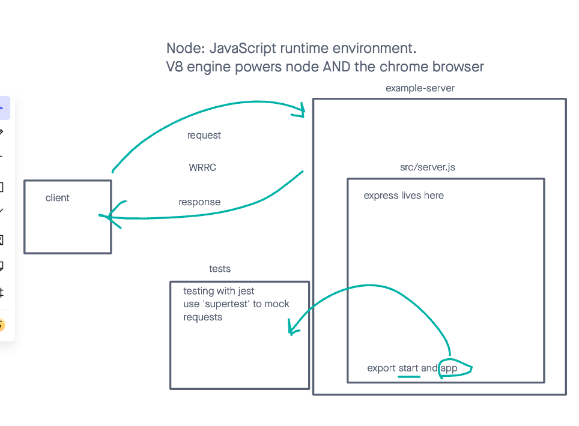

# LAB - Class 01

## Project: Server Deployment Practice

### Author: Donna Ada

### Problem Domain

Hands on practice with Node.js to get started with CI and CD exercise.

### Links and Resources

- [GitHub Actions ci/cd](https://github.com/donnaada/server-deployment-practice/actions)
- [back-end dev server url](https://server-deployment-practice-dev-zr6v.onrender.com)
- [back-end prod server url](https://server-deployment-practice-main-wgdp.onrender.com)

### Collaborators

Used Ryan Gallaway's Demo Code with permission

### Setup

#### `.env` requirements (where applicable)

Port variable located within .env.sample

#### How to initialize/run your application (where applicable)

clone repo, `npm i`, then run `nodemon` in terminal

#### Features / Routes

- GET : `/success` - specific route to hit

#### Tests

To Run tests, run the command `npm test`

#### UML

